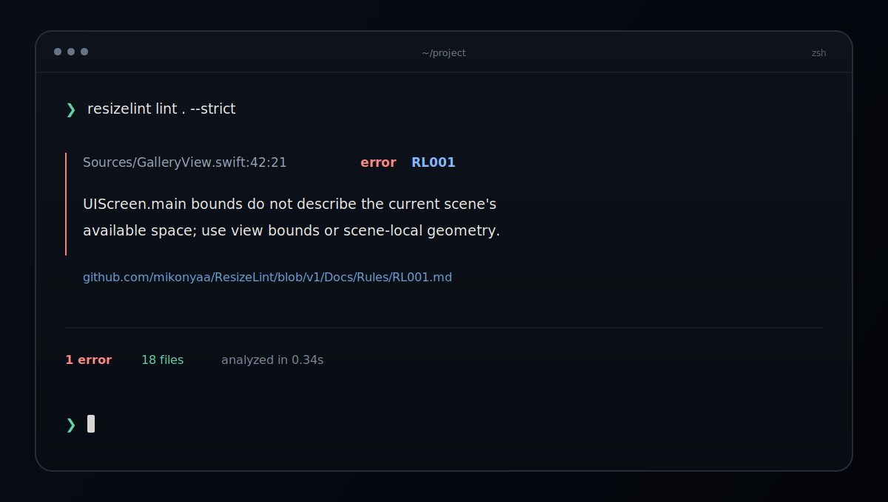

<div align="center">
  <a href="#the-collection"></a>
  <br><br>
  <h1>Apple Design Templates</h1>
  <p><strong>Focused SwiftUI foundations for real Apple-platform products.</strong></p>
  <p>Open a complete demo. Understand the architecture. Adapt only what your product needs.</p>
  <p>Curated by <a href="https://github.com/mikonyaa"><strong>miko.os</strong></a></p>
  <p>
    <a href="https://www.swift.org"></a>
    <a href="https://developer.apple.com/xcode/swiftui/"></a>
    <a href="#the-collection"></a>
    <a href="LICENSE"></a>
  </p>
  <p><a href="README.ru.md">Русская версия</a></p>
</div>

---

Apple Design Templates is a public catalog of independent SwiftUI starting points and focused Apple-platform tooling—not a monorepo and not a speculative component dump. Every project owns its source, runnable evidence, documentation, tests, issues, CI, and release history.

The collection follows three rules:

- **Native first.** System APIs and Apple-platform conventions are the baseline.
- **Runnable by default.** Demos use deterministic local data and require no account or backend.
- **Small enough to adapt.** Each package solves one recognizable product problem without becoming a framework for hypothetical needs.

## The collection

- **Liquid Glass Tab Bars** — a focused navigation component for an existing iOS app.
- **Adaptive App Shell** — an application shell that scales from iPhone tabs to an iPad workspace.
- **Live Activity & Dynamic Island Kit** — reusable system-surface rendering with a complete ActivityKit demo.
- **Mac Menu Bar Command Kit** — a native command shell for focused macOS utilities.

The catalog also includes **ResizeLint**, a developer tool for finding Swift layout assumptions that fail when an iPhone app runs in a resizable window. It is intentionally presented outside the numbered template collection.

## 01 / Liquid Glass Tab Bars

> **Stable 1.0.3** · iOS 17+ · Swift 6 · Native iOS 26 Liquid Glass

Three tab-bar approaches built around one reusable selection model: system, floating, and morphing.

<p align="center">
  <a href="https://github.com/mikonyaa/LiquidGlassTabBars">
    
  </a>
</p>

- Uses the system `TabView` when platform behavior is the right answer.
- Provides focused custom variants for two to five primary destinations.
- Respects Dynamic Type, Reduce Motion, and Reduce Transparency with practical iOS 17–25 fallbacks.

**[Open repository](https://github.com/mikonyaa/LiquidGlassTabBars)** · [Latest release](https://github.com/mikonyaa/LiquidGlassTabBars/releases/latest) · [Documentation](https://github.com/mikonyaa/LiquidGlassTabBars/tree/main/Docs)

---

## 02 / Adaptive App Shell

> **Stable 1.0.3** · iOS 17+ · Swift 6 · iPhone and iPad

One navigation state model that moves cleanly between compact bottom tabs and a regular-width sidebar workspace.

<p align="center">
  <a href="https://github.com/mikonyaa/AdaptiveAppShell">
    
  </a>
</p>

- Preserves an independent navigation path for every destination.
- Supports sidebar-only collections, enum-based deep links, and an optional contextual inspector.
- Ships three restrained semantic themes with opaque content surfaces and guarded system glass.

**[Open repository](https://github.com/mikonyaa/AdaptiveAppShell)** · [Latest release](https://github.com/mikonyaa/AdaptiveAppShell/releases/latest) · [Documentation](https://github.com/mikonyaa/AdaptiveAppShell/tree/main/Docs)

---

## 03 / Live Activity & Dynamic Island Kit

> **Released 0.1.0** · iOS 17+ · Swift 6 · Xcode 16.4+

A small, domain-neutral rendering core for glanceable Live Activity surfaces, paired with a polished Activity Lab and app-owned ActivityKit lifecycle.

<p align="center">
  <a href="https://github.com/mikonyaa/LiveActivityDynamicIslandKit">
    
  </a>
</p>

- Covers Lock Screen plus compact, minimal, and expanded Dynamic Island surfaces.
- Demonstrates delivery, ride, timer, sports, transfer, and trip states without putting those domains in the package API.
- Includes start, update, relaunch recovery, exact deep links, end, accessibility, and safe timeline examples.
- Supports adaptive Porcelain styling plus app-defined light and dark appearance palettes.

**[Open repository](https://github.com/mikonyaa/LiveActivityDynamicIslandKit)** · [Latest release](https://github.com/mikonyaa/LiveActivityDynamicIslandKit/releases/latest) · [Documentation](https://github.com/mikonyaa/LiveActivityDynamicIslandKit/tree/main/Docs)

---

## 04 / Mac Menu Bar Command Kit

> **Published 0.2.0** · macOS 14+ · Swift 6 · Native SwiftUI scenes

A keyboard-first menu bar command shell for timers, clipboard workflows, notes, system tools, and focused productivity utilities.

<p align="center">
  <a href="https://github.com/mikonyaa/MacMenuBarCommandKit">
    
  </a>
</p>

- Combines `MenuBarExtra`, a regular main window, command palette, Settings, and Launch at Login.
- Keeps command metadata separate from app-owned behavior and platform side effects.
- Demonstrates real pasteboard input/output, keyboard shortcuts, local state, and visible execution results.

**[Open repository](https://github.com/mikonyaa/MacMenuBarCommandKit)** · [Latest release](https://github.com/mikonyaa/MacMenuBarCommandKit/releases/latest) · [Documentation](https://github.com/mikonyaa/MacMenuBarCommandKit/tree/main/Docs)

---

## Developer tool / ResizeLint

> **Stable 1.0.0** · macOS 14+ and Ubuntu 22.04+ · Swift 6 · CLI and GitHub Action

Deterministic local static analysis for the UIKit and Swift layout assumptions that break when an iPhone app no longer owns the full physical display.

<p align="center">
  <a href="https://github.com/mikonyaa/ResizeLint">
    
  </a>
</p>

- Covers nine high-confidence rules for global screen geometry, scene lifecycle, device idiom, orientation, and adaptive layout decisions.
- Keeps source local and emits deterministic human, Xcode, JSON, and SARIF reports without an account, daemon, telemetry, or cloud service.
- Ships a checksum-verifying `mikonyaa/ResizeLint@v1` Action plus signed and notarized universal macOS artifacts and a Linux x86_64 binary.

Install the notarized macOS package from the verified `1.0.0` release:

```bash
curl -fLO https://github.com/mikonyaa/ResizeLint/releases/download/1.0.0/ResizeLint-1.0.0-macos-universal.pkg
sudo installer -pkg ResizeLint-1.0.0-macos-universal.pkg -target /
resizelint version
```

**[Open repository](https://github.com/mikonyaa/ResizeLint)** · [Release 1.0.0](https://github.com/mikonyaa/ResizeLint/releases/tag/1.0.0) · [Rule reference](https://github.com/mikonyaa/ResizeLint/tree/1.0.0/Docs/Rules) · [CLI reference](https://github.com/mikonyaa/ResizeLint/blob/1.0.0/Docs/CLI.md)

## Choose by outcome

- **I already have an app and need better tab navigation:** start with [Liquid Glass Tab Bars](https://github.com/mikonyaa/LiquidGlassTabBars).
- **I am defining navigation for a new iPhone and iPad product:** start with [Adaptive App Shell](https://github.com/mikonyaa/AdaptiveAppShell).
- **I need glanceable status outside the app:** start with [Live Activity & Dynamic Island Kit](https://github.com/mikonyaa/LiveActivityDynamicIslandKit).
- **I am building a focused Mac utility:** start with [Mac Menu Bar Command Kit](https://github.com/mikonyaa/MacMenuBarCommandKit).
- **I need to catch non-adaptive UIKit assumptions before runtime QA:** add [ResizeLint](https://github.com/mikonyaa/ResizeLint) locally and in CI.

Pick the smallest project that owns the problem. Combining all four templates is rarely the right first move; ResizeLint can verify any Swift app independently.

## Collection quality bar

Every listed repository is expected to provide:

- a focused Swift Package with no third-party runtime dependency;
- a runnable Xcode project backed by deterministic local data;
- platform-appropriate accessibility and earlier-system fallbacks;
- unit tests, CI, a changelog, and versioned releases for published templates;
- architecture, integration, customization, and quality guidance;
- screenshots or motion captured from the real demo rather than concept renders.

Developer tools may replace the runnable app demo with reproducible CLI fixtures, machine-readable output, release checksums, and platform-specific distribution evidence. They remain separate from the design-template count.

## Use a template in three steps

1. **Choose** the smallest repository that matches the product problem.
2. **Run** its checked-in demo and read the architecture notes before copying code.
3. **Adapt** the package or focused source while keeping business models and platform side effects in your app.

## Collection principles

- **Native behavior over imitation.** Platform conventions remain intact unless a custom interaction earns its complexity.
- **Clarity over decoration.** Hierarchy, spacing, contrast, and motion support content rather than compete with it.
- **Adaptation over rigid screens.** Components expose semantic configuration and respond to their environment.
- **Finished systems over unfinished libraries.** Stable means the code, demo, docs, tests, release, and preview agree.
- **Release truth over marketing.** Unreleased or device-gated work stays visibly labeled as preview.

New templates and tools appear only after they are runnable, documented, tested, and useful as independent products. Detailed implementation guidance belongs in each project repository. Collection-level proposals are welcome through [Issues](https://github.com/mikonyaa/Apple-Design-Templates/issues) after reviewing [CONTRIBUTING.md](CONTRIBUTING.md).

---

<div align="center">
  <p><a href="CONTRIBUTING.md">Contributing</a> · <a href="SECURITY.md">Security</a> · <a href="LICENSE">MIT License</a></p>
  <p>Built and maintained by <a href="https://github.com/mikonyaa"><strong>miko.os</strong></a>.</p>
  <p>If the collection helped you ship something better, consider starring the catalog or the template you used.</p>
</div>
