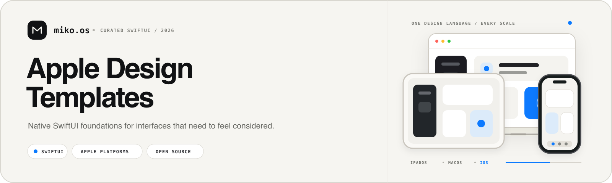
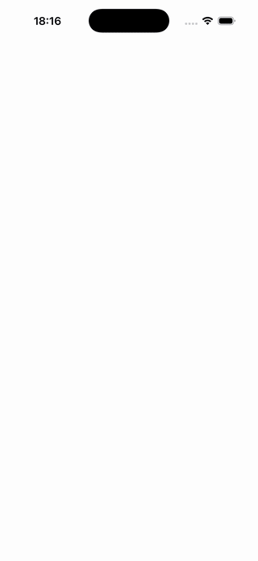
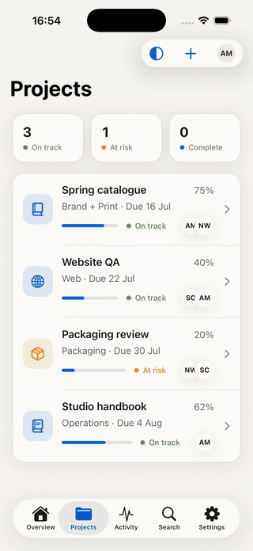
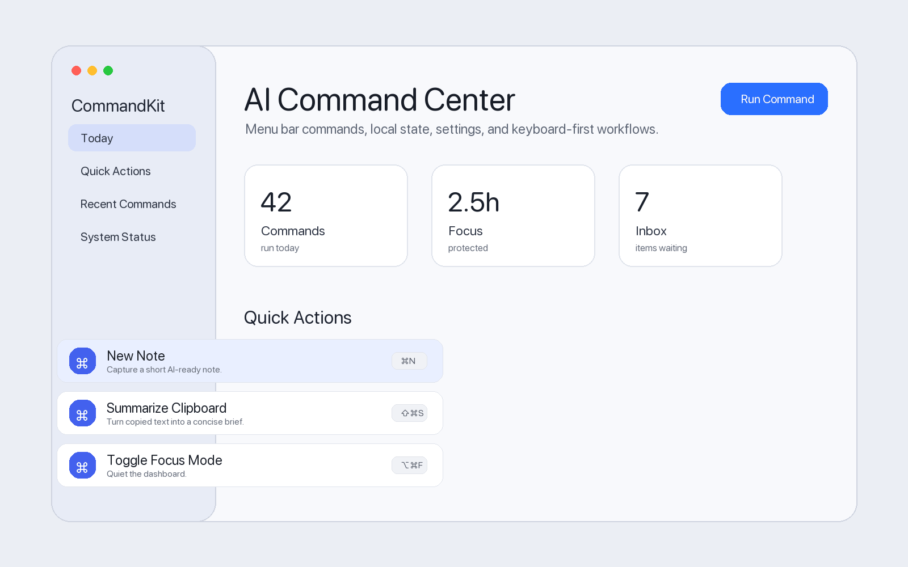

  
    
  <h1>Apple Design Templates</h1>
  
<strong>Focused SwiftUI systems for real Apple-platform products.</strong>

  
Study a complete implementation, run the demo, and adapt only what your product needs.

  
Curated by <a href="https://github.com/mikonyaa"><strong>miko.os</strong></a>

  

    
    
    
    
  

  
<a href="README.ru.md">Русская версия</a>

---

Apple Design Templates is a curated collection of independent SwiftUI starting points. It is intentionally a catalog rather than a monorepo: every template has its own focused source, demo, documentation, issues, and CI. Published templates also carry versioned releases.

<table>
  <tr>
    <th width="33%">Native-first</th>
    <th width="33%">Runnable by default</th>
    <th width="33%">Designed to adapt</th>
  </tr>
  <tr>
    <td valign="top">System APIs and Apple-platform conventions form the baseline. Custom UI is used only when it adds a clear product benefit.</td>
    <td valign="top">Every entry includes an Xcode demo with deterministic local data—no account, backend, or setup ceremony required.</td>
    <td valign="top">Small packages, semantic themes, and explicit state ownership make each template practical to restyle and integrate.</td>
  </tr>
</table>

## Featured templates

<table>
  <tr>
    <th width="25%">Liquid Glass Tab Bars</th>
    <th width="25%">Adaptive App Shell</th>
    <th width="25%">Live Activity &amp; Dynamic Island Kit</th>
    <th width="25%">Mac Menu Bar Command Kit</th>
  </tr>
  <tr>
    <td align="center">
      
    </td>
    <td align="center">
      
    </td>
    <td align="center">
      
    </td>
    <td align="center">
      
    </td>
  </tr>
  <tr>
    <td valign="top">
      
<strong>Stable 1.0.2</strong> · iOS 17+ · Swift 6

      
Three tab-bar approaches built around one reusable selection model.

      <ul>
        <li>Native, floating, and morphing variants</li>
        <li>iOS 26 Liquid Glass with practical fallbacks</li>
        <li>Dynamic Type, Reduce Motion, and Reduce Transparency support</li>
      </ul>
      
<strong><a href="https://github.com/mikonyaa/LiquidGlassTabBars">Repository</a></strong> · <a href="https://github.com/mikonyaa/LiquidGlassTabBars/releases/latest">Release</a> · <a href="https://github.com/mikonyaa/LiquidGlassTabBars/tree/main/Docs">Documentation</a>

    </td>
    <td valign="top">
      
<strong>Stable 1.0.2</strong> · iOS 17+ · Swift 6

      
One navigation model that scales from compact tabs to a regular-width workspace.

      <ul>
        <li>Bottom tabs on iPhone and a sidebar on iPad</li>
        <li>Independent navigation history and enum-based deep links</li>
        <li>Optional inspector and three restrained, gradient-free themes</li>
      </ul>
      
<strong><a href="https://github.com/mikonyaa/AdaptiveAppShell">Repository</a></strong> · <a href="https://github.com/mikonyaa/AdaptiveAppShell/releases/latest">Release</a> · <a href="https://github.com/mikonyaa/AdaptiveAppShell/tree/main/Docs">Documentation</a>

    </td>
    <td valign="top">
      
<strong>Preview · Unreleased</strong> · iOS 17+ · Swift 6

      
ActivityKit recipes for polished Lock Screen and Dynamic Island experiences.

      <ul>
        <li>Delivery, ride, timer, sports, download, and trip states</li>
        <li>Lock Screen, compact, minimal, and expanded Dynamic Island surfaces</li>
        <li>Real WidgetKit extension, local lifecycle controls, and optional XcodeGen</li>
      </ul>
      
<strong><a href="https://github.com/mikonyaa/LiveActivityDynamicIslandKit">Repository</a></strong> · <a href="https://github.com/mikonyaa/LiveActivityDynamicIslandKit/tree/main/Docs">Documentation</a>

    </td>
    <td valign="top">
      
<strong>Initial 0.1.0</strong> · macOS 14+ · Swift 6

      
A native menu bar command shell for Mac productivity utilities.

      <ul>
        <li>MenuBarExtra dashboard, main window, dismissible command palette overlay, and Settings</li>
        <li>Metadata-first command registry with eight useful local demo actions</li>
        <li>Launch at Login service, keyboard shortcuts, and local run script</li>
      </ul>
      
<strong><a href="https://github.com/mikonyaa/MacMenuBarCommandKit">Repository</a></strong> · <a href="https://github.com/mikonyaa/MacMenuBarCommandKit/releases/latest">Release</a> · <a href="https://github.com/mikonyaa/MacMenuBarCommandKit/tree/main/Docs">Documentation</a>

    </td>
  </tr>
</table>

## Compare by need

| Decision | Liquid Glass Tab Bars | Adaptive App Shell | Live Activity & Dynamic Island Kit | Mac Menu Bar Command Kit |
| --- | --- | --- | --- | --- |
| Best starting point | Adding a polished navigation control to an existing app | Establishing navigation for a new iPhone and iPad product | Designing system Live Activities for real product states | Starting a Mac menu bar utility with command actions, clipboard workflows, and settings |
| Primary responsibility | Tab selection, presentation, and theming | App-wide destinations, navigation history, sidebar, and inspector | ActivityKit state, WidgetKit configuration, and glanceable system UI | MenuBarExtra, command registry, command palette overlay, Settings, and Launch at Login |
| Adaptive behavior | Three interchangeable tab-bar treatments | Compact tabs and regular-width split navigation | Lock Screen plus compact, minimal, and expanded Dynamic Island surfaces | Menu bar dashboard plus regular Dock-visible main window |
| Integration scope | Focused component package | Application-shell foundation | Swift Package, demo app, and WidgetKit extension template | Swift Package, macOS demo app, docs, tests, and local run script |

## What every template includes

| Project surface | Collection baseline |
| --- | --- |
| Reusable source | A focused Swift Package with no third-party runtime dependencies |
| Working example | A runnable Xcode project using deterministic local data |
| Platform behavior | Accessibility considerations and practical fallbacks for supported systems |
| Verification | Unit tests, GitHub Actions, a changelog, and a tagged release for published templates |
| Learning material | Architecture, integration, customization, accessibility, and beginner guidance |
| Honest previews | Screenshots and motion captured from the real demo rather than concept renders |

## How the collection works

<table>
  <tr>
    <th width="33%">1 · Choose</th>
    <th width="33%">2 · Run</th>
    <th width="33%">3 · Adapt</th>
  </tr>
  <tr>
    <td valign="top">Pick the smallest template that matches the problem you are solving.</td>
    <td valign="top">Open its repository, launch the included demo, and review the implementation notes.</td>
    <td valign="top">Add the Swift Package or bring the focused source into your own design system.</td>
  </tr>
</table>

## Collection principles

- **Native behavior over imitation.** Platform conventions remain intact unless a custom interaction earns its complexity.
- **Clarity over decoration.** Hierarchy, spacing, contrast, and motion must support the content rather than compete with it.
- **Adaptation over rigid screens.** Components expose semantic configuration and layouts respond to their environment.
- **Finished systems over unfinished libraries.** A template is marked stable only when its code, demo, docs, tests, release, and preview agree. Earlier entries stay explicitly labeled as previews.

> New templates remain labeled as previews until they are runnable, documented, tested, and ready to adapt. The catalog does not use fictional projects or placeholder previews to look larger than it is.

Detailed implementation guidance belongs in the relevant template repository. Collection-level proposals are welcome through [Issues](https://github.com/mikonyaa/Apple-Design-Templates/issues) after reviewing [CONTRIBUTING.md](CONTRIBUTING.md).

---

  
<a href="CONTRIBUTING.md">Contributing</a> · <a href="SECURITY.md">Security</a> · <a href="LICENSE">MIT License</a>

  
Built and maintained by <a href="https://github.com/mikonyaa"><strong>miko.os</strong></a>.

  
If this collection helps you build a better Apple-platform app, consider starring the repository or the template you used.

